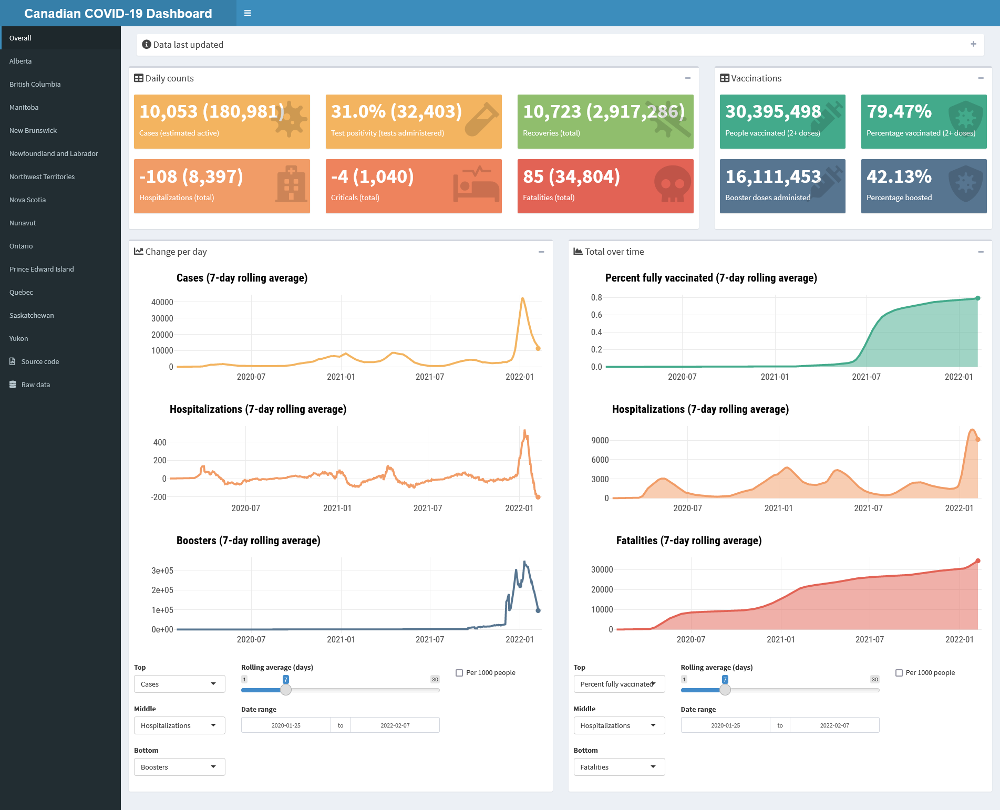

<!-- README.md is generated from README.Rmd. Please edit that file -->

```{r, include = FALSE}
knitr::opts_chunk$set(
  collapse = TRUE,
  comment = "#>",
  fig.path = "man/figures/README-",
  out.width = "100%"
)
```

# canadacovidshiny

<!-- badges: start -->
[](https://lifecycle.r-lib.org/articles/stages.html#stable)
<!-- badges: end -->

This is a dashboard reporting the latest COVID-19 numbers and visualizing the trends over time, both overall and by province/territory.

It is currently being hosted on shinyapps.io here: https://taylor-dunn.shinyapps.io/canadacovidshiny/.

The app may be unavailable or not working at times, probably because it has reached the usage limit for the month (25 active hours).
For posterity, below is a screenshot of version 0.1.0 as of 2022-02-07:



The data come from the [Canadian COVID-19 Tracker API](https://api.covid19tracker.ca/docs/1.0/overview).
The data are periodically downloaded via the [`canadacovid` package](https://taylordunn.github.io/canadacovid/) to [this repository](https://github.com/taylordunn/canadacoviddata).
The Shiny app checks the data and will reactively update only when the data are new.

